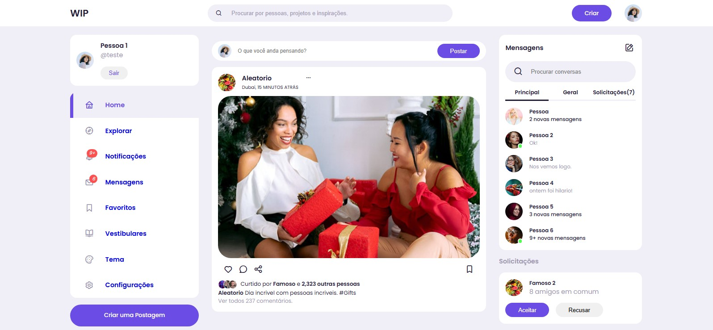

# WIP - Rede Social Educacional

## 📌 Sobre o Projeto

**WIP** é um projeto acadêmico que visa integrar funcionalidades essenciais para um ambiente educacional e social. Inspirado em redes sociais populares, o objetivo principal é criar um espaço onde estudantes possam interagir, compartilhar conhecimentos e se conectar com outros usuários de forma intuitiva.

## 🎯 Funcionalidades Principais

- **Feed de Publicações** 📢: Compartilhe ideias, dúvidas e informações relevantes.
- **Mensagens Diretas** 💬: Converse com outros usuários em tempo real.
- **Notificações** 🔔: Fique atualizado sobre interações e novidades.
- **Sistema de Amizades** 🤝: Conecte-se com colegas e professores.
- **Modo Escuro/Claro** 🎨: Personalize a interface para melhor experiência de uso.

## 🚀 Tecnologias Utilizadas

- **Front-end**: HTML, CSS, JavaScript

## 🏫 Propósito Acadêmico

Este projeto foi desenvolvido como parte das atividades acadêmicas no curso de **Assistente de Desenvolvimento de Aplicativos Computacionais - SENAC-SP.**. O intuito é demonstrar a aplicação prática de conceitos de **desenvolvimento web e experiência do usuário**.

---

📌 *Este é apenas o front-end do projeto.*
